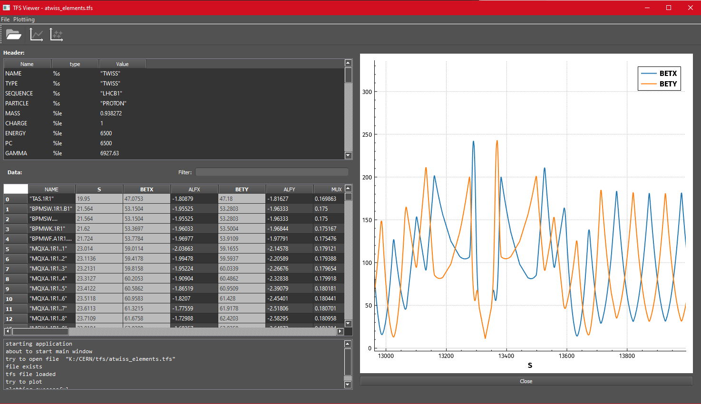

# qtfsviewer

A simple viewer of MADX TFS files using the Qt framework.



## Installation

### Build from source

To build from source, clone the repository and build it using your usual Qt build tools.
The easiest way is probaly getting the Qt SDK from [the Qt homepage](https://www.qt.io/download) and follow the installation instruction.

This project is released under Qt's open source rules, so it links dynamically to Qt. In linux this means that the Qt runtime has to be installed.
**Windows users** need to _deploy_ their built binaries first.

### Binary release

Check out my precompiled binaries in the [Releases](https://github.com/awegsche/qtfsviewer/releases) tab on the right. 

Currently there are releases for Win10_x64 and Linux x64 (Ubuntu 20.04?). Both should be self contained. Just download the archive and unpack.

**Note**: Currently this project only supports Qt5 from Qt5.12 onwards. Qt6 is not supported but an upgrade is planned.


## Usage

[Optional] After successfull installation / build, add the binary's directory to your `PATH` (or use any other method to be able to conveniently launch the executable).

The executable can be launched in commandline like this

```
tfsviewer <PATH_TO_FILE>
```

which takes as optional argument the path to a TFS file to open. If no path is supplied, it will open an empty session.


### Opening Files

The folder icon and `File->open` shows an open file dialog

### Filtering

Right to the label `Data` there is a search box.
Typing a pattern will filter for this pattern in all String columns of the dataframe.

`Ctrl-F` jumps to the search box.

The search accepts regular expressions.
As an example, the pattern `MQ\.\d+[RL]\d` will search for all (de)focusing quadrupoles in LHC.
### Plotting

Plotting uses the great [QCustomPlot](https://www.qcustomplot.com/).


The line plot icon  and `Plotting->Line Plot` shows a line plot. For this, the plot data has to be selected first:
 - select a whole column: the values are plotted against an integer index
 - select more than one column: the values are plotted against the column that has been selected first (multi-select with *Ctrl+click*)
 - everything else will result in the error message: "wrong number of columns selected: 0"
 
 The scatter plot icon  and `Plotting->Scatter Plot` does the same but shows a scatter plot (bug: no colors)
 
 ## Issues and Todos:
 
 - Editing! (for now, data can't be edited, added or removed)
 - saving standard tfs files
 - creating empty tfs
 
 - add more plot colors, make plots editable
 - save plots to various output formats (png, pdf, latex???)

## License

To comply with Qt's rules, this project is licensed under GPL.
